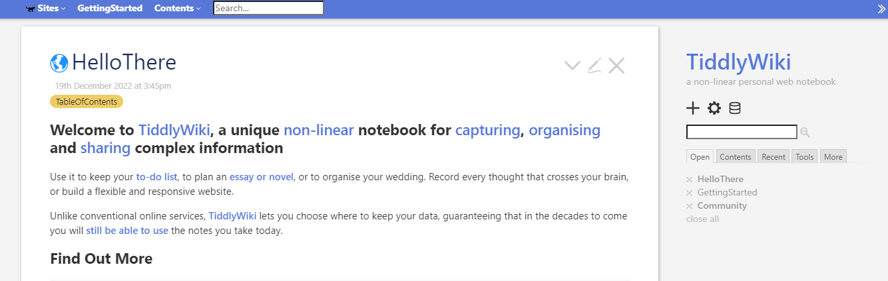
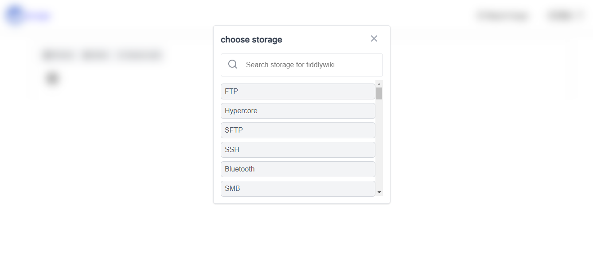

 

 

<h5 align="center">Mindcrazyapps.github.io</h5>

<h4 align="center"> Please see this live demo <a href="https://tiddlywiki-store.netlify.app/"> here </a>  and the <a href="https://mindcrazyapps.github.io/tiddlywiki-store/#/"> documentation </a> here </h3>

#  tiddlywiki-store

*use case: Select storage for your tiddlywiki with tiddlywiki-store (ui)*

*img*

## License & Contributors
This code is licensed under the MIT license and contributors here:

