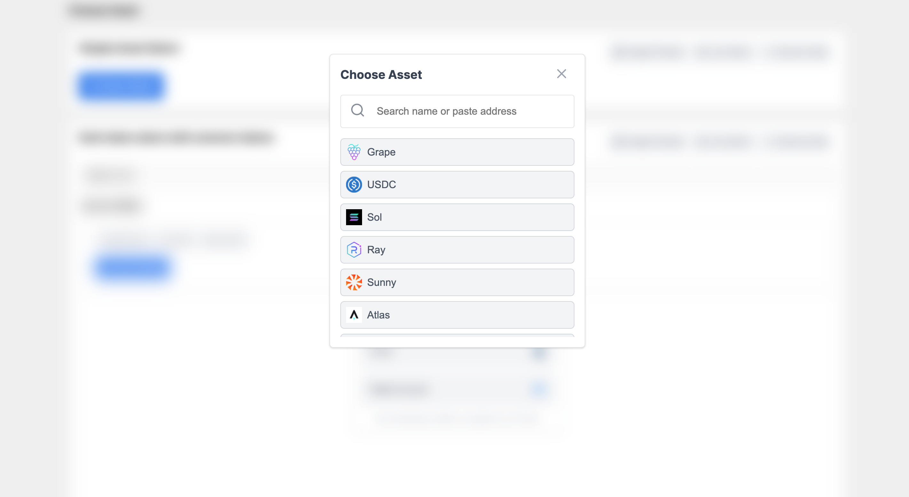
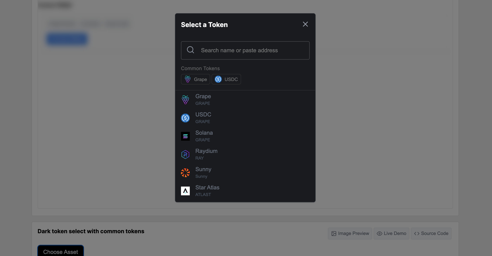

# tiddlywiki-storage
tiddlywiki-storage is based from [Web3 UI Kit](https://github.com/devzstudio/Web3UIKit/)(Opensource Web3 UI Components using ReactJs, Styled Components) and [remotestorage-widget](https://github.com/remotestorage/remotestorage-widget). 

*So, please see this live demo [here](https://tiddlywiki-storage.netlify.app/)*

#### Select storage for your tiddlywiki with tiddlywiki-storage

